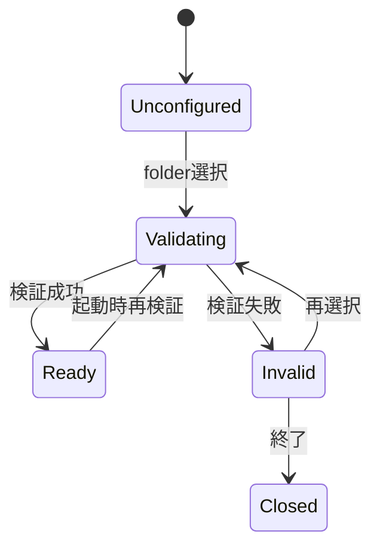
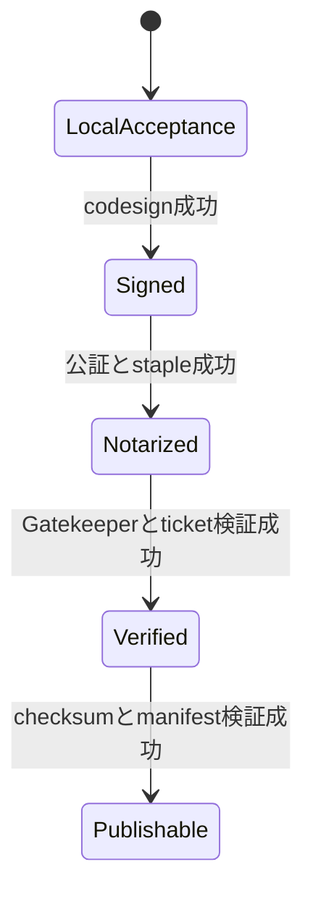

# U10 Business Logic Model

## Workspace Flow

### テキスト代替

未設定状態ではfolder選択だけを許可する。選択後に検証し、成功すればReady、失敗すればInvalidになる。起動時は保存済み参照を必ず再検証する。Invalidでは再選択または終了だけを許可する。

### Workspace検証

1. 選択値をabsolute canonical pathへ変換する。
2. directoryであり、利用者がread／writeできることを確認する。
3. app resource、`userData`、他の禁止rootと重ならないことを確認する。
4. `input`、`public`、`generated`、`output`を検査し、不足分だけを作成する。
5. 作成途中で失敗した場合は新規作成分をcleanupし、参照を保存しない。
6. 検証済み参照を`userData`へatomic保存する。

## Dependency Diagnosis Flow

- 起動後にCodexとVOICEVOXの軽量診断を独立実行する。
- Codex Real接続直前にCodexだけを再診断する。
- Voice実行直前にVOICEVOXだけを再診断する。
- 状態は`ready`、`missing`、`stopped`、`unsupported`、`unauthenticated`、`unreachable`へ分類する。
- 診断失敗は対象機能だけを停止し、他の制作機能を維持する。

## Release Flow

### テキスト代替

すべての成果物はLocalAcceptanceから始まる。署名、公証、Gatekeeper／ticket検証、checksum／manifest検証を順に成功した場合だけPublishableへ進む。途中段階の省略、逆行、失敗時の昇格は認めない。

## Packaged Command Flow

1. Rendererが目的別requestを送る。
2. MainがReady状態のWorkspace rootを要求する。
3. Resource Resolverがpackaged runtime entryを返す。
4. 固定commandと検証済みargvを構築する。
5. 既存Command Runnerが実行し、progressとterminal stateを通知する。
6. Stop、失敗、終了時にprocess、listener、temporary fileをcleanupする。
