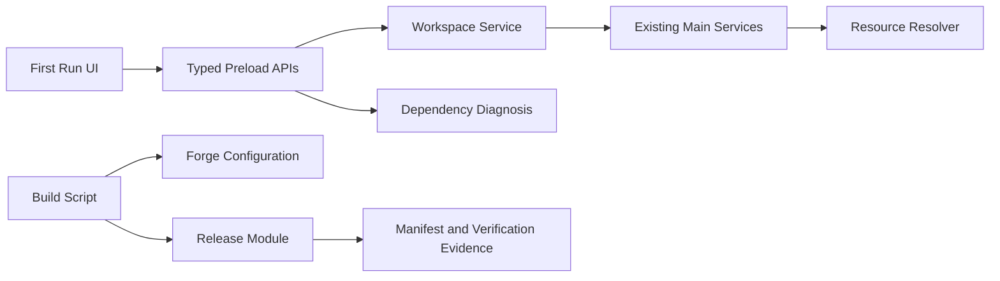

# U10 Component依存関係

## Dependency Matrix

| 呼出元 | 呼出先 | 通信 | 制約 |
|---|---|---|---|
| First-Run Renderer | Purpose-Specific Preload APIs | typed IPC | Node／任意invokeなし |
| Preload APIs | Workspace Service | `ipcRenderer.invoke` | 固定channel |
| Preload APIs | Dependency Diagnosis Service | `ipcRenderer.invoke` | 安定action code |
| Local File／Command／Preview／Render | Workspace Service | Main内call | 有効root必須 |
| Packaged Command Adapter | Resource Resolver | Main内call | allowlist resource |
| Dependency Diagnosis Service | Codex／VOICEVOX adapter | argv／local HTTP | timeout、redaction |
| Build Script | Package Build Configuration | npm／Forge | lockfile固定 |
| Build Script | Release Module | Node API | runtimeから隔離 |
| Release Module | codesign／notarytool／spctl | argv | shell連結なし |

## Data Flow

### テキスト代替

First Run UIはtyped Preload APIだけを介してWorkspace ServiceとDependency Diagnosisへ接続する。Workspace Serviceは既存Main serviceへ検証済みrootを供給し、Resource Resolverはpackaged entryを供給する。Runtimeとは別に、Build ScriptがForgeとRelease Moduleを呼び、manifestと検証証跡を生成する。

## Coupling方針

- 既存Main serviceはWorkspace rootをdependencyとして受け取り、global cwdを参照しない。
- Release Moduleの純粋判定関数だけをPBT対象として直接importできる。
- RendererはOS path、credential、command argvを構築しない。
- Forge固有設定をapplication domain interfaceで包まない。
