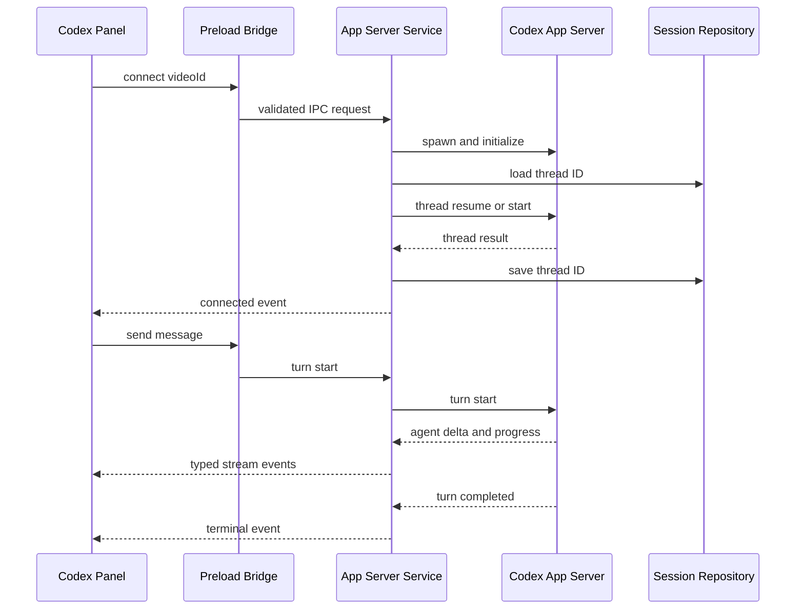
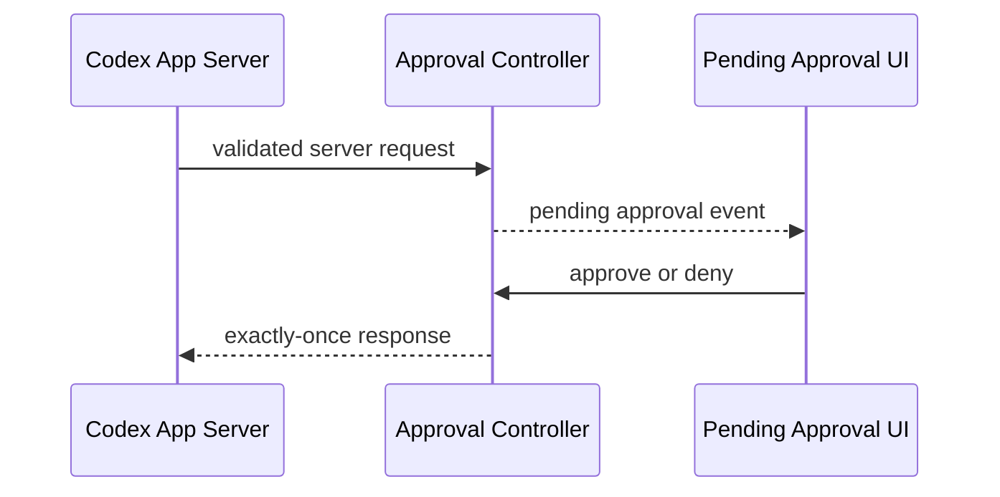

# Component Dependencies: U9 Real Codex App Server Integration

## Dependency Matrix

| Consumer | Dependency | Communication | Constraint |
|---|---|---|---|
| Hardened Electron Shell | App Server Service | Direct main-process call | Shutdown ownership |
| App Server Service | Protocol Codec | Pure function calls | Raw JSONL stays in main |
| App Server Service | Session Repository | Async local file I/O | Workspace-scoped path |
| App Server Service | Approval Controller | Direct calls and callback | Fail closed |
| Preload Bridge | App Server Service | Typed IPC invoke/event | No generic request |
| Real Connection Adapter | Preload Bridge | Context Bridge API | No Node access |
| Codex Panel | Real/Mock Adapter | Typed connection contract | Source is visible |
| Codex Panel | Approval Controller | Typed IPC event/response | Explicit decision |
| Renderer clients | Local File Service | Purpose-specific IPC | No absolute target path |

## Connection and Turn Flow

### Text Alternative

Codex Panel sends a videoId-only connect request through the Preload Bridge. The main App Server Service starts and initializes Codex, loads or creates the Workspace thread, persists its ID, and returns typed events. A user message starts a turn; only validated delta, progress, approval, and terminal events cross back to the Renderer。

## Approval Flow

### Text Alternative

An App Server approval request is validated and registered by the Approval Controller. The UI returns an explicit approve or deny decision. The controller sends at most one terminal response. Timeout, disconnect, and shutdown resolve as deny。

## Dependency Rules

- C2 App Server Service does not import React or Renderer code。
- C3 Protocol Codec is pure and independently property-testable。
- C6 Preload Bridge exposes frozen purpose-specific functions only。
- C7 Real Adapter does not access filesystem or child process。
- Existing Mock adapter does not depend on C2 and remains usable when Codex is unavailable。
