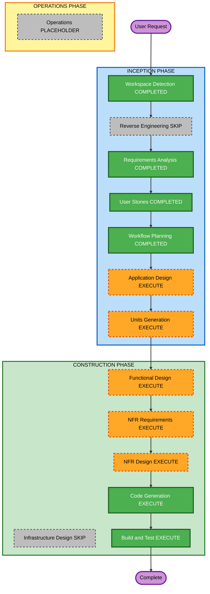

# Execution Plan

## Detailed Analysis Summary

### Change Impact Assessment

- **User-facing changes**: Yes. The project creates a new CLI workflow for video creators.
- **Structural changes**: Yes. A new TypeScript, Node.js, React, and Remotion application will be created.
- **Data model changes**: Yes. New script, scene, speaker, video, subtitle, visual, manifest, and timeline models are required.
- **API changes**: Yes. The system integrates with VOICEVOX Engine HTTP APIs.
- **NFR impact**: Yes. Maintainability, caching performance, safe file path handling, portability, and testability affect the design.

### Risk Assessment

- **Risk Level**: Medium
- **Rollback Complexity**: Easy while greenfield, because no production code exists yet.
- **Testing Complexity**: Moderate. Unit tests are straightforward, while VOICEVOX and Remotion require lightweight integration checks and local environment dependencies.

### Primary Components

- Script validation and loading.
- Asset checking and path safety.
- VOICEVOX client and voice generation.
- Audio duration measurement.
- Manifest and cache management.
- Timeline generation.
- Remotion React composition and components.
- CLI orchestration.
- Tests and build scripts.

## Workflow Visualization

### Mermaid Diagram

### Text Alternative

- INCEPTION: Workspace Detection completed, Reverse Engineering skipped, Requirements Analysis completed, User Stories completed, Workflow Planning completed, Application Design executes next, Units Generation executes after design.
- CONSTRUCTION: Functional Design executes, NFR Requirements executes, NFR Design executes, Infrastructure Design is skipped, Code Generation executes, Build and Test executes.
- OPERATIONS: Operations remains a placeholder and is not part of this MVP workflow.

## Phases to Execute

### INCEPTION PHASE

- [x] Workspace Detection - COMPLETED
- [x] Reverse Engineering - SKIPPED
  - **Rationale**: No existing application codebase was detected.
- [x] Requirements Analysis - COMPLETED
- [x] User Stories - COMPLETED
- [x] Workflow Planning - IN PROGRESS
- [ ] Application Design - EXECUTE
  - **Rationale**: New components, service boundaries, shared models, CLI flows, and rendering responsibilities need definition.
- [ ] Units Generation - EXECUTE
  - **Rationale**: The MVP spans multiple logical units and needs a structured implementation sequence.

### CONSTRUCTION PHASE

- [ ] Functional Design - EXECUTE
  - **Rationale**: Script validation, cache hashing, subtitle splitting, timeline math, and asset path handling require detailed business logic design.
- [ ] NFR Requirements - EXECUTE
  - **Rationale**: Maintainability, safe path handling, performance through caching, portability, and testability affect the implementation.
- [ ] NFR Design - EXECUTE
  - **Rationale**: NFR requirements must be reflected in module boundaries, error handling, validation, tests, and local runtime assumptions.
- [ ] Infrastructure Design - SKIP
  - **Rationale**: MVP is a local macOS CLI and Remotion project with no cloud infrastructure or deployment architecture.
- [ ] Code Generation - EXECUTE
  - **Rationale**: Application code, scripts, sample inputs, assets, tests, and documentation need to be generated.
- [ ] Build and Test - EXECUTE
  - **Rationale**: Build instructions, unit tests, lightweight integration tests, and manual render verification are required.

### OPERATIONS PHASE

- [ ] Operations - PLACEHOLDER
  - **Rationale**: Deployment and monitoring workflows are out of scope for the current AIDLC implementation.

## Recommended Unit Sequence

1. Project foundation and shared types.
2. Script loading, validation, asset checks, and path safety.
3. VOICEVOX client, voice generation, cache manifest, and audio duration.
4. Timeline generation.
5. Remotion composition and scene components.
6. CLI orchestration and render integration.
7. Tests, placeholders, sample data, and README.

## Estimated Timeline

- **Total Stages to Execute After Workflow Planning**: 7
- **Estimated Duration**: Multi-stage implementation session with approval gates between design, unit planning, code generation, and build/test.

## Success Criteria

- Requirements, stories, design, unit plan, implementation plan, generated code, and build/test instructions are traceable.
- `npm run video -- {videoId}` supports the MVP flow when VOICEVOX Engine is available.
- Unit tests and lightweight integration tests cover the approved test scope.
- Placeholder assets allow Remotion preview/render verification before real Zundamon assets are added.

## Extension Compliance Summary

- Security Baseline: N/A. Disabled during Requirements Analysis.
- Resiliency Baseline: N/A. Disabled during Requirements Analysis.
- Property-Based Testing: N/A. Disabled during Requirements Analysis.

