# U10 実行計画

## 詳細分析

- **変更種別**: 単一Electronアプリの配布モデル追加
- **主変更**: production build、Forge、Workspace選択、依存診断、署名・公証、release gate
- **維持する境界**: 既存CLI、context isolation、Codex、VOICEVOX、Remotion制作フロー
- **利用者影響**: 初回起動、依存不足案内、手動更新、復旧
- **データ影響**: 制作schemaは不変。`userData`へWorkspace参照だけを保存する。
- **API影響**: 外部APIなし。Workspace選択と診断用の限定IPCを追加する。
- **NFR影響**: path境界、secret、署名・公証、supply chain、fail-closed、復旧、PBT

## Component関係

- **主対象**: Electron Main、Preload、Renderer bootstrap、package configuration
- **上流**: npm lockfile、Electron Forge、Apple signing／notarytool、Codex CLI、VOICEVOX
- **共有境界**: Workspace path、command execution、release manifest、packaged resource path
- **下流**: Script、asset、Validate、Voice、Preview、Render、Stop、Finder reveal
- **支援成果物**: icon、日本語文書、release checklist、SBOM、checksum

## リスク評価

- **水準**: 高
- **理由**: path／権限境界、secret、署名・公証、未署名成果物の誤配布を扱う。
- **ロールバック**: 中。既知正常revisionと開発起動を維持し、成果物をversion別に分離する。
- **テスト**: 高。unit、PBT、packaged Electron E2E、新規macOS利用者プロファイル確認が必要。

## ワークフロー

```mermaid
flowchart TD
    Start(["U10開始"])
    WD["Workspace Detection<br/><b>完了</b>"]
    RE["Reverse Engineering<br/><b>完了</b>"]
    RA["Requirements Analysis<br/><b>完了</b>"]
    US["User Stories<br/><b>完了</b>"]
    WP["Workflow Planning<br/><b>レビュー</b>"]
    AD["Application Design<br/><b>実施</b>"]
    UG["Units Generation<br/><b>省略</b>"]
    FD["Functional Design<br/><b>実施</b>"]
    NFRA["NFR Requirements<br/><b>実施</b>"]
    NFRD["NFR Design<br/><b>実施</b>"]
    ID["Infrastructure Design<br/><b>省略</b>"]
    CG["Code Generation<br/><b>実施</b>"]
    BT["Build and Test<br/><b>実施</b>"]
    OPS["Operations<br/><b>プレースホルダー</b>"]
    End(["U10完了"])
    Start --> WD
    WD --> RE
    RE --> RA
    RA --> US
    US --> WP
    WP --> AD
    AD --> UG
    UG --> FD
    FD --> NFRA
    NFRA --> NFRD
    NFRD --> ID
    ID --> CG
    CG --> BT
    BT --> OPS
    OPS --> End
    style WD fill:#4CAF50,stroke:#1B5E20,stroke-width:3px,color:#fff
    style RE fill:#4CAF50,stroke:#1B5E20,stroke-width:3px,color:#fff
    style RA fill:#4CAF50,stroke:#1B5E20,stroke-width:3px,color:#fff
    style US fill:#4CAF50,stroke:#1B5E20,stroke-width:3px,color:#fff
    style WP fill:#4CAF50,stroke:#1B5E20,stroke-width:3px,color:#fff
    style AD fill:#FFA726,stroke:#E65100,stroke-width:3px,stroke-dasharray:5 5,color:#000
    style FD fill:#FFA726,stroke:#E65100,stroke-width:3px,stroke-dasharray:5 5,color:#000
    style NFRA fill:#FFA726,stroke:#E65100,stroke-width:3px,stroke-dasharray:5 5,color:#000
    style NFRD fill:#FFA726,stroke:#E65100,stroke-width:3px,stroke-dasharray:5 5,color:#000
    style CG fill:#4CAF50,stroke:#1B5E20,stroke-width:3px,color:#fff
    style BT fill:#4CAF50,stroke:#1B5E20,stroke-width:3px,color:#fff
    style UG fill:#BDBDBD,stroke:#424242,stroke-width:2px,stroke-dasharray:5 5,color:#000
    style ID fill:#BDBDBD,stroke:#424242,stroke-width:2px,stroke-dasharray:5 5,color:#000
    style OPS fill:#BDBDBD,stroke:#424242,stroke-width:2px,stroke-dasharray:5 5,color:#000
    style Start fill:#CE93D8,stroke:#6A1B9A,stroke-width:3px,color:#000
    style End fill:#CE93D8,stroke:#6A1B9A,stroke-width:3px,color:#000
    linkStyle default stroke:#333,stroke-width:2px
```

### テキスト代替

完了済み4段階とWorkflow Planningの後、Application Designを実施しUnits Generationを省略する。Functional Design、NFR Requirements、NFR Designを実施しInfrastructure Designを省略する。Code Generation、Build and Test、Operationsプレースホルダーの順に進む。

## 段階判断

- [x] Workspace Detection - 完了
- [x] Reverse Engineering - 完了
- [x] Requirements Analysis - 完了・承認済み
- [x] User Stories - 完了・承認済み
- [x] Workflow Planning - 完了、承認待ち
- [ ] Application Design - 実施。Workspace、依存診断、packaged command、release IPC責務を定義する。
- [x] Units Generation - 省略。単一packageの1成果物であり分割価値がない。
- [ ] Functional Design - 実施。Workspace、診断、release状態遷移を定義する。
- [ ] NFR Requirements - 実施。Security、Resiliency、性能計測、完全PBTを具体化する。
- [ ] NFR Design - 実施。path allowlist、fail-closed、secret redaction、cleanup、rollbackを設計する。
- [x] Infrastructure Design - 省略。Cloud／network infrastructure変更なし。
- [ ] Code Generation - 実施。コード、テスト、文書、release設定を生成する。
- [ ] Build and Test - 実施。回帰、PBT、package smoke、Electron E2E、release検証を行う。
- [ ] Operations - プレースホルダー。外部deployやrelease uploadは行わない。

## 変更順序

1. Package identity、production entry、Forge設定、icon
2. Packaged resource resolverとWorkspace選択・永続化
3. Packaged commandとCodex／VOICEVOX診断
4. 署名・公証、release state、配布禁止gate
5. SBOM、checksum、manifest、inclusion検査
6. 日本語文書とclean-profile checklist
7. 例示テスト、完全PBT、package E2E、release検証

## 成功条件

- arm64 `.app`とZIPがproduction codeだけで起動する。
- Workspaceを安全に保存・再検証し、packaged環境で制作できる。
- 外部依存不足を区別し、日本語で復旧案内できる。
- 未署名成果物をlocal acceptanceに限定し、一般配布をfail closedで禁止できる。
- 署名・公証・Gatekeeper・ticket・checksumを検証できる。
- SBOM、manifest、文書、checklistと全テストが完成する。

## Extension準拠

- **Security Baseline**: path検証、最小権限IPC、credential非保存、CSP、署名、公証、SBOM、checksum、fail-closedを全段階で追跡する。Cloud固有規則は適用外。阻害事項なし。
- **Resiliency Baseline**: Workspace保護、依存障害、package／公証失敗、rollback、fault injection、recoveryを追跡する。Cloud HA／DRは適用外。阻害事項なし。
- **Property-Based Testing**: path、config、manifest、release状態遷移を設計、実装、build gateで追跡する。阻害事項なし。
