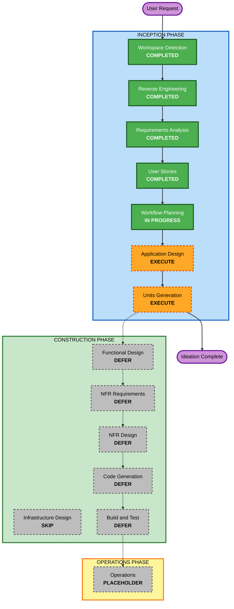

# Execution Plan: GUI with Embedded Codex Panel

## Detailed Analysis Summary

### Transformation Scope

- **Transformation Type**: Brownfield application feature addition.
- **Primary Changes**: Add a local video production GUI above the existing TypeScript, Remotion, VOICEVOX, and CLI pipeline.
- **Related Components**:
  - Existing script schema and types.
  - Existing validation and asset checking services.
  - Existing voice, timeline, preview, and render commands.
  - New GUI application shell.
  - New Codex App Server integration boundary.
  - New draft JSON and approval state model.

### Change Impact Assessment

- **User-facing changes**: Yes. This introduces the primary production UI for creator workflows.
- **Structural changes**: Yes. A GUI layer, command orchestration boundary, and Codex integration boundary are needed.
- **Data model changes**: Yes. The existing `VideoScript` remains canonical, but draft proposal state and GUI session state must be designed.
- **API changes**: Internal only. No public HTTP API exists today, but GUI-to-core and GUI-to-Codex interfaces need contracts.
- **NFR impact**: Yes. Responsiveness, recoverability, approval safety, and testability affect the design.

### Component Relationships

- **Primary Component**: `zundamon-video-generator`.
- **Existing Core Components**: `src/core`, `src/schemas`, `src/types`, `scripts`, `src/components`, `src/compositions`.
- **New GUI Components**: GUI shell, editor views, Codex panel, preview panel, command runner, log panel, asset selector.
- **Integration Components**: Codex App Server adapter, local file access adapter, Remotion preview/render adapter.
- **Infrastructure Components**: None for MVP. This remains a local macOS tool.

### Risk Assessment

- **Risk Level**: High for implementation, medium for planning.
- **Rollback Complexity**: Moderate if GUI is isolated above existing CLI; difficult if core pipeline is rewritten.
- **Testing Complexity**: Complex. It spans UI state, local file operations, Codex action approval, generated artifacts, and long-running commands.

## Workflow Visualization

### Mermaid Diagram

### Text Alternative

- Completed: Workspace Detection, Reverse Engineering, Requirements Analysis, User Stories.
- Current: Workflow Planning.
- Recommended next: Application Design.
- Recommended after that: Units Generation.
- Deferred until explicit implementation request: Functional Design, NFR Requirements, NFR Design, Code Generation, Build and Test.
- Skipped for MVP: Infrastructure Design.

## Phases to Execute

### INCEPTION PHASE

- [x] Workspace Detection - COMPLETED
- [x] Reverse Engineering - COMPLETED
- [x] Requirements Analysis - COMPLETED
- [x] User Stories - COMPLETED
- [x] Workflow Planning - IN PROGRESS
- [ ] Application Design - EXECUTE
  - **Rationale**: New GUI components, Codex boundary, draft state, command runner, preview surface, and service dependencies need definition.
- [ ] Units Generation - EXECUTE
  - **Rationale**: The GUI concept should be decomposed into manageable units such as app shell, Codex integration, draft review, asset handling, command orchestration, and preview/render workflow.

### CONSTRUCTION PHASE

- [ ] Functional Design - DEFER
  - **Rationale**: Useful before implementation, but the user is currently refining ideas and has not asked to build the GUI yet.
- [ ] NFR Requirements - DEFER
  - **Rationale**: NFRs are known at a high level, but detailed construction-level NFR assessment should wait until implementation scope is approved.
- [ ] NFR Design - DEFER
  - **Rationale**: Depends on chosen GUI technology and integration strategy.
- [ ] Infrastructure Design - SKIP
  - **Rationale**: MVP is a local macOS tool with no cloud infrastructure.
- [ ] Code Generation - DEFER
  - **Rationale**: Implementation is intentionally deferred while the product idea is being refined.
- [ ] Build and Test - DEFER
  - **Rationale**: Build and test activities follow implementation.

### OPERATIONS PHASE

- [ ] Operations - PLACEHOLDER
  - **Rationale**: No deployment or production operations scope for this local MVP.

## Package Change Sequence

This is a single-package repository. When implementation is approved later, the likely sequence is:

1. Add GUI app shell and local server or desktop wrapper boundary.
2. Add project state and draft JSON model.
3. Add script review and scene editing UI.
4. Add asset selection and path placement flow.
5. Add command orchestration and log streaming.
6. Add Codex App Server integration.
7. Add preview and render integration.
8. Preserve and verify CLI compatibility.

## Estimated Timeline

- **Current ideation/design continuation**: 2 stages.
- **Implementation route later**: multiple construction stages, likely 6 to 8 implementation units.

## Success Criteria For This Planning Pass

- Application-level component architecture is clear.
- GUI responsibility boundaries are separated from existing CLI/rendering core.
- Codex App Server role is defined without overcommitting implementation details.
- Units of work are decomposed enough to support a later implementation plan.
- User can decide whether to proceed to implementation after reviewing design artifacts.

## Extension Compliance

- **Security Baseline**: Disabled by user choice; skipped.
- **Resiliency Baseline**: Disabled by user choice; skipped.
- **Property-Based Testing**: Disabled by user choice; skipped.

