# U11 Execution Plan

## Detailed Analysis Summary

### Transformation Scope

- **Transformation Type**: Single package, documentation-first productization change with one small CLI/support script addition.
- **Primary Changes**: README restructuring, internal acceptance preflight command, clean-profile smoke checklist, acceptance evidence template, Post-MVP backlog and top-three feature specifications.
- **Related Components**: README, package scripts, release artifact verifier outputs, build/test commands, docs under `docs/`, AI-DLC planning artifacts.
- **Out of Scope for U11 Code**: Series management, template library, multiple Workspace management, cloud sharing, auto update, YouTube integration, complete Codex automation.

### Change Impact Assessment

- **User-facing changes**: Yes. Non-developer internal users get a Desktop-first setup and smoke-test path.
- **Structural changes**: Minor. No runtime architecture change is planned; preflight may add a CLI support entry point.
- **Data model changes**: No production data model changes. Future feature specifications describe prospective versioned JSON models only.
- **API changes**: No current IPC or external API change required for U11. Future specifications may define typed IPC later, outside this unit.
- **NFR impact**: Yes. Security, resiliency, usability, maintainability, and Partial PBT constraints apply.

### Component Relationships

- **Primary Component**: Documentation and local release support within `zundamon-video-generator`.
- **Release Boundary**: Existing package outputs, SBOM, SHA-256, release manifest, release state classification.
- **Build/Test Boundary**: npm scripts for typecheck, default tests, Studio build, production dependency audit, and release verification.
- **User Documentation Boundary**: README plus internal acceptance checklist and evidence template.
- **Future Planning Boundary**: Post-MVP backlog/spec documents only; no product code for Next features in U11.

| Component | Change Type | Change Reason | Priority |
|---|---|---|---|
| README | Major documentation | Desktop-first internal adoption path | Critical |
| Internal acceptance docs | New documentation | Clean-profile smoke and evidence capture | Critical |
| Preflight command | Minor application tooling | Non-destructive release acceptance check | Critical |
| Release scripts/contracts | Minor or reuse | Validate artifact state without duplicating release logic | Important |
| Post-MVP planning docs | New planning artifacts | Decide backlog, roadmap, and top-three specs | Important |
| Electron runtime UI | No U11 implementation | Future features only | N/A |

### Risk Assessment

- **Risk Level**: Medium.
- **Rollback Complexity**: Easy for README/docs; moderate for any package script addition because release validation must remain fail closed.
- **Testing Complexity**: Moderate. U11 needs documentation review plus CLI/preflight tests for missing artifact, checksum mismatch, wrong architecture, wrong release state, and successful local-acceptance classification.
- **Primary Risks**:
  - Accidentally implying unsigned `local-acceptance` artifacts are public-release ready.
  - Duplicating release-state logic in documentation or preflight instead of reusing manifest/release verification.
  - Changing Workspace, input, asset, or output data during preflight.
  - Over-designing future features beyond U11's documentation boundary.

## Module Update Strategy

- **Update Approach**: Sequential within one npm package.
- **Critical Path**: Requirements and stories -> workflow approval -> focused design -> preflight/code plan -> implementation -> build/test.
- **Coordination Points**: Release manifest schema, package scripts, README command examples, acceptance checklist evidence fields.
- **Testing Checkpoints**: After preflight implementation, run typecheck, targeted tests, default tests, and local preflight where artifacts are present.

| Area | Dependency Constraints | Change Scope |
|---|---|---|
| README and docs | Must match existing release behavior and command names | Minor compatible |
| Preflight script | Must use existing release manifest/state contracts where possible | Minor compatible |
| Tests | Must preserve existing Vitest and fast-check setup | Patch |
| Post-MVP specs | Must not change production runtime behavior | Documentation only |

## Workflow Visualization

### Mermaid Diagram

```mermaid
flowchart TD
    Start(["User Request"])

    subgraph INCEPTION["INCEPTION PHASE"]
        WD["Workspace Detection<br/><b>COMPLETED</b>"]
        RE["Reverse Engineering<br/><b>COMPLETED</b>"]
        RA["Requirements Analysis<br/><b>COMPLETED</b>"]
        US["User Stories<br/><b>COMPLETED</b>"]
        WP["Workflow Planning<br/><b>IN REVIEW</b>"]
        AD["Application Design<br/><b>EXECUTE</b>"]
        UG["Units Generation<br/><b>SKIP</b>"]
    end

    subgraph CONSTRUCTION["CONSTRUCTION PHASE"]
        FD["Functional Design<br/><b>EXECUTE</b>"]
        NFRA["NFR Requirements<br/><b>EXECUTE</b>"]
        NFRD["NFR Design<br/><b>EXECUTE</b>"]
        ID["Infrastructure Design<br/><b>SKIP</b>"]
        CG["Code Generation<br/><b>EXECUTE</b>"]
        BT["Build and Test<br/><b>EXECUTE</b>"]
    end

    subgraph OPERATIONS["OPERATIONS PHASE"]
        OPS["Operations<br/><b>PLACEHOLDER</b>"]
    end

    Start --> WD
    WD --> RE
    RE --> RA
    RA --> US
    US --> WP
    WP --> AD
    AD --> UG
    UG --> FD
    FD --> NFRA
    NFRA --> NFRD
    NFRD --> ID
    ID --> CG
    CG --> BT
    BT --> OPS
    OPS --> End(["Complete"])

    style WD fill:#4CAF50,stroke:#1B5E20,stroke-width:3px,color:#fff
    style RE fill:#4CAF50,stroke:#1B5E20,stroke-width:3px,color:#fff
    style RA fill:#4CAF50,stroke:#1B5E20,stroke-width:3px,color:#fff
    style US fill:#4CAF50,stroke:#1B5E20,stroke-width:3px,color:#fff
    style WP fill:#FFA726,stroke:#E65100,stroke-width:3px,stroke-dasharray: 5 5,color:#000
    style AD fill:#FFA726,stroke:#E65100,stroke-width:3px,stroke-dasharray: 5 5,color:#000
    style UG fill:#BDBDBD,stroke:#424242,stroke-width:2px,stroke-dasharray: 5 5,color:#000
    style FD fill:#FFA726,stroke:#E65100,stroke-width:3px,stroke-dasharray: 5 5,color:#000
    style NFRA fill:#FFA726,stroke:#E65100,stroke-width:3px,stroke-dasharray: 5 5,color:#000
    style NFRD fill:#FFA726,stroke:#E65100,stroke-width:3px,stroke-dasharray: 5 5,color:#000
    style ID fill:#BDBDBD,stroke:#424242,stroke-width:2px,stroke-dasharray: 5 5,color:#000
    style CG fill:#4CAF50,stroke:#1B5E20,stroke-width:3px,color:#fff
    style BT fill:#4CAF50,stroke:#1B5E20,stroke-width:3px,color:#fff
    style OPS fill:#BDBDBD,stroke:#424242,stroke-width:2px,stroke-dasharray: 5 5,color:#000
    style Start fill:#CE93D8,stroke:#6A1B9A,stroke-width:3px,color:#000
    style End fill:#CE93D8,stroke:#6A1B9A,stroke-width:3px,color:#000
    style INCEPTION fill:#BBDEFB,stroke:#1565C0,stroke-width:3px,color:#000
    style CONSTRUCTION fill:#C8E6C9,stroke:#2E7D32,stroke-width:3px,color:#000
    style OPERATIONS fill:#FFF59D,stroke:#F57F17,stroke-width:3px,color:#000
    linkStyle default stroke:#333,stroke-width:2px
```



### Text Alternative

```text
INCEPTION
- Workspace Detection: COMPLETED
- Reverse Engineering: COMPLETED
- Requirements Analysis: COMPLETED
- User Stories: COMPLETED
- Workflow Planning: IN REVIEW
- Application Design: EXECUTE
- Units Generation: SKIP

CONSTRUCTION
- Functional Design: EXECUTE
- NFR Requirements: EXECUTE
- NFR Design: EXECUTE
- Infrastructure Design: SKIP
- Code Generation: EXECUTE
- Build and Test: EXECUTE

OPERATIONS
- Operations: PLACEHOLDER
```

## Phases to Execute

### INCEPTION PHASE

- [x] Workspace Detection - COMPLETED
  - **Rationale**: Existing brownfield AI-DLC project detected and resumed.
- [x] Reverse Engineering - COMPLETED
  - **Rationale**: Current reverse-engineering artifacts exist and were reused.
- [x] Requirements Analysis - COMPLETED
  - **Rationale**: U11 requirements, extension configuration, and recovery decisions were approved.
- [x] User Stories - COMPLETED
  - **Rationale**: U11 has direct user-facing internal adoption flows and future feature epics.
- [x] Workflow Planning - IN REVIEW
  - **Rationale**: This document defines the recommended execution path.
- [ ] Application Design - EXECUTE
  - **Rationale**: Preflight command responsibilities, documentation boundaries, future feature specification boundaries, and release-state reuse need component-level design.
- [ ] Units Generation - SKIP
  - **Rationale**: U11 is one cohesive package-level unit. Future features are specification-only and should not be decomposed into implementation units yet.

### CONSTRUCTION PHASE

- [ ] Functional Design - EXECUTE
  - **Rationale**: Preflight behavior, artifact validation, evidence template semantics, and future backlog/spec rules need detailed design.
- [ ] NFR Requirements - EXECUTE
  - **Rationale**: Security, resiliency, usability, maintainability, and Partial PBT constraints are active and user-approved.
- [ ] NFR Design - EXECUTE
  - **Rationale**: Fail-closed release-state handling, non-destructive preflight, secret-safe reporting, and seed-replay testing patterns need explicit design.
- [ ] Infrastructure Design - SKIP
  - **Rationale**: No cloud infrastructure, installer feed, CI/CD pipeline, database, network topology, or deployment infrastructure change is in scope.
- [ ] Code Generation - EXECUTE
  - **Rationale**: U11 requires README/docs updates, preflight command implementation, package script wiring, and tests.
- [ ] Build and Test - EXECUTE
  - **Rationale**: U11 needs build, test, preflight, and documentation-verification instructions.

### OPERATIONS PHASE

- [ ] Operations - PLACEHOLDER
  - **Rationale**: Operations is not active in the current AI-DLC workflow. U11 deployment remains local direct/in-place acceptance only.

## Proposed Unit

### U11: Internal Adoption and Post-MVP Planning

- **Scope**: README, internal acceptance preflight, clean-profile smoke checklist, evidence template, Post-MVP backlog, and Next top-three specifications.
- **Implementation Boundary**: Implement only internal adoption and acceptance support. Do not implement series management, template library, or multiple Workspace management in product code.
- **Primary Artifacts**:
  - README update.
  - Internal acceptance checklist.
  - Acceptance evidence template.
  - Post-MVP backlog and roadmap.
  - Top-three feature specifications.
  - Preflight command and focused tests.

## Extension Compliance Summary

| Extension | Status | Applicable Rules |
|---|---|---|
| Security Baseline | Compliant | Artifact integrity, dependency lock/audit, no secret/PII reporting, fail-closed release state, bounded validation. Cloud/network/authentication rules are N/A for U11. |
| Resiliency Baseline | Compliant | Low criticality, RTO/RPO, local Backup & Restore, direct/in-place deployment, rollback note, incident Markdown. Multi-zone/multi-region/cloud monitoring rules are N/A. |
| Property-Based Testing (Partial) | Compliant | PBT-02, PBT-03, PBT-07, PBT-08, PBT-09 apply to new pure parser/serializer/normalizer logic if introduced. Other PBT rules are advisory in Partial mode. |

## Approval Options

Use `aidlc-docs/inception/plans/workflow-planning-approval.md` to approve this plan or request changes.
