# Execution Plan: U9 Real Codex App Server Integration

## Detailed Analysis

### Transformation Scope

- **Type**: Brownfield integration architecture change within one application package。
- **Primary change**: U2 Mock-only renderer adapterへ、Electron main-owned real App Server clientを追加する。
- **Preserved boundaries**: Existing `CodexConnection`、chat history、proposal approval、Command Runner、Preview、Render。
- **No infrastructure change**: Local stdio subprocessのみ。Network listener、cloud resources、deployment pipelineは追加しない。

### Change Impact

- **User-facing**: Real connection status、streaming response、reconnect、Mock selector、approval progress。
- **Structural**: Shared protocol contract、main-process service、typed IPC/preload、renderer adapterを追加。
- **Data**: Workspace local stateへthread IDを追加。Canonical video script schemaは変更しない。
- **API**: Internal Electron IPCだけを追加。Public HTTP APIなし。
- **NFR**: Authentication、sandbox、approval、message validation、timeouts、retry、resource cleanup、PBT。

### Component Relationships

- **Primary**: Real Codex App Server Service in Electron main process。
- **Upstream**: Local Codex CLI executable and existing ChatGPT login。
- **Shared**: Chat/protocol types、Workspace identity、thread state persistence。
- **Downstream**: Preload bridge、Renderer real connection adapter、CodexPanel。
- **Supporting**: Existing proposal approval controller、chat history store、structured logger。

### Risk Assessment

- **Risk Level**: High。Local agent processがWorkspace mutationを要求できるため。
- **Rollback Complexity**: Moderate。Mock modeとGit known-good revisionを維持する。
- **Testing Complexity**: Complex。Protocol order、streaming、process failure、approval、stateful transitionsを検証する。

## Workflow Visualization

```mermaid
flowchart TD
    Start(["U9 Request"])
    WD["Workspace Detection<br/><b>COMPLETED</b>"]
    RE["Reverse Engineering<br/><b>REUSED</b>"]
    RA["Requirements Analysis<br/><b>COMPLETED</b>"]
    US["User Stories<br/><b>SKIP</b>"]
    WP["Workflow Planning<br/><b>REVIEW</b>"]
    AD["Application Design<br/><b>EXECUTE</b>"]
    UG["Units Generation<br/><b>SKIP</b>"]
    FD["Functional Design<br/><b>EXECUTE</b>"]
    NFRA["NFR Requirements<br/><b>EXECUTE</b>"]
    NFRD["NFR Design<br/><b>EXECUTE</b>"]
    ID["Infrastructure Design<br/><b>SKIP</b>"]
    CG["Code Generation<br/><b>EXECUTE</b>"]
    BT["Build and Test<br/><b>EXECUTE</b>"]
    OPS["Operations<br/><b>PLACEHOLDER</b>"]
    End(["U9 Complete"])

    Start --> WD
    WD --> RE
    RE --> RA
    RA --> US
    US --> WP
    WP --> AD
    AD --> UG
    UG --> FD
    FD --> NFRA
    NFRA --> NFRD
    NFRD --> ID
    ID --> CG
    CG --> BT
    BT --> OPS
    OPS --> End

    style WD fill:#4CAF50,stroke:#1B5E20,stroke-width:3px,color:#fff
    style RE fill:#4CAF50,stroke:#1B5E20,stroke-width:3px,color:#fff
    style RA fill:#4CAF50,stroke:#1B5E20,stroke-width:3px,color:#fff
    style WP fill:#4CAF50,stroke:#1B5E20,stroke-width:3px,color:#fff
    style AD fill:#FFA726,stroke:#E65100,stroke-width:3px,stroke-dasharray:5 5,color:#000
    style FD fill:#FFA726,stroke:#E65100,stroke-width:3px,stroke-dasharray:5 5,color:#000
    style NFRA fill:#FFA726,stroke:#E65100,stroke-width:3px,stroke-dasharray:5 5,color:#000
    style NFRD fill:#FFA726,stroke:#E65100,stroke-width:3px,stroke-dasharray:5 5,color:#000
    style CG fill:#4CAF50,stroke:#1B5E20,stroke-width:3px,color:#fff
    style BT fill:#4CAF50,stroke:#1B5E20,stroke-width:3px,color:#fff
    style US fill:#BDBDBD,stroke:#424242,stroke-width:2px,stroke-dasharray:5 5,color:#000
    style UG fill:#BDBDBD,stroke:#424242,stroke-width:2px,stroke-dasharray:5 5,color:#000
    style ID fill:#BDBDBD,stroke:#424242,stroke-width:2px,stroke-dasharray:5 5,color:#000
    style OPS fill:#BDBDBD,stroke:#424242,stroke-width:2px,stroke-dasharray:5 5,color:#000
    style Start fill:#CE93D8,stroke:#6A1B9A,stroke-width:3px,color:#000
    style End fill:#CE93D8,stroke:#6A1B9A,stroke-width:3px,color:#000
    linkStyle default stroke:#333,stroke-width:2px
```

### Text Alternative

Workspace Detection completed, reverse-engineering artifacts reused, Requirements completed, User Stories skipped, Workflow Planning reviewed, Application Design executed, Units Generation skipped, Functional Design executed, NFR Requirements executed, NFR Design executed, Infrastructure Design skipped, Code Generation executed, Build and Test executed, then Operations placeholder closes U9。

## Phase Decisions

### Inception

- [x] Workspace Detection - completed。
- [x] Reverse Engineering - current artifacts reused。
- [x] Requirements Analysis - completed and approved。
- [x] User Stories - skip。Existing US-3、US-4、US-5、US-8 cover the same persona and journeys。
- [x] Workflow Planning - complete; approval pending。
- [ ] Application Design - execute at minimal depth。Move App Server ownership from Renderer assumption to Electron main process and define IPC/service dependencies。
- [ ] Units Generation - skip。U9 is already one cohesive unit and additional decomposition adds no independent delivery value。

### Construction

- [ ] Functional Design - execute。Protocol lifecycle、thread/turn state、approval mapping、failure transitions、testable propertiesを定義する。
- [ ] NFR Requirements - execute。Security、resiliency、PBT framework、timeouts、limitsを確定する。
- [ ] NFR Design - execute。Fail-closed approval、bounded retry、resource cleanup、logging redaction、stateful PBTを設計する。
- [ ] Infrastructure Design - skip。Local stdio subprocessだけでcloud infrastructure変更なし。
- [ ] Code Generation - execute。Planning approval後にapplication code、tests、documentationを生成する。
- [ ] Build and Test - execute。Typecheck、example tests、seed-reproducible PBT、Studio build、real App Server smokeを実行する。

### Operations

- [ ] Operations - placeholder。Local deployment and monitoring implementationはU9 scope外。

## Change Sequence

1. Shared protocol、connection、stream event contracts。
2. Electron main App Server process and JSONL client。
3. Workspace thread persistence and approval mapping。
4. Narrow IPC and preload bridge。
5. Renderer real connection adapter and CodexPanel streaming UI。
6. Example-based tests and property-based tests。
7. Integrated build、Mock regression、real App Server smoke。

各stepは前段contractに依存するためsequential updateとし、testsは各boundary完成時に追加する。

## Success Criteria

- Existing Codex loginでstable stdio App Server sessionが開始できる。
- Workspace threadがstart/resumeされ、agent deltaとterminal statusが表示される。
- Mutation requestが既存approval UIを通り、deny/errorはfail closedになる。
- Bounded retry、timeout、cleanup、manual reconnect、explicit Mock modeが機能する。
- U1〜U8およびCLI compatibilityが回帰しない。
- Example tests、full PBT、typecheck、Studio build、manual real connection smokeがpassする。

## Extension Compliance

### Security Baseline

- **Compliant**: Plan includes validation、least privilege、main-process isolation、credential redaction、approval、supply-chain/build verification、fail-closed handling。
- **N/A**: Network intermediary、cloud IAM/network、HTTP-serving controls。
- **Blocking findings**: なし。

### Resiliency Baseline

- **Compliant**: Plan carries forward Low criticality、local recovery decisions、bounded dependency behavior、rollback、incident tracking。
- **N/A**: Cloud HA、DR、autoscaling、regional topology。
- **Blocking findings**: なし。

### Property-Based Testing

- **Compliant**: Functional Design property identification、NFR framework selection、Code Generation PBT、Build seed reproductionをscheduled stagesへ含めた。
- **Blocking findings**: なし。
